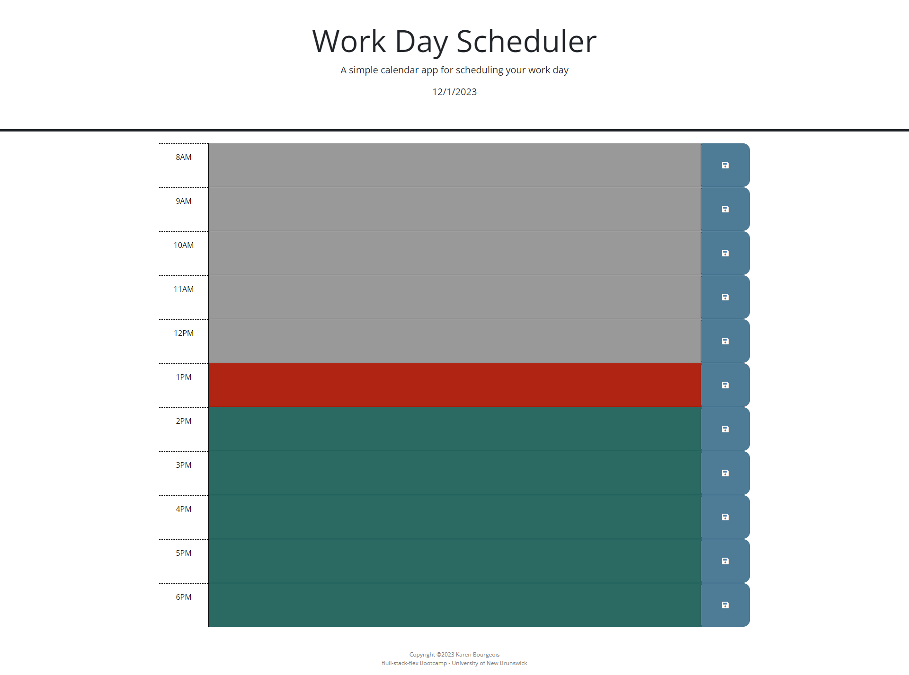

# Daily-Schedule

## Description

This application is a daily-schedule for one day. The purpose is to be able to have the colours change accounding to what time it is and be able to enter in events. The events must be able to be saved.

## User Story

AS AN employee with a busy schedule
I WANT to add important events to a daily planner
SO THAT I can manage my time effectively

## Acceptance Criteria

- GIVEN I am using a daily planner to create a schedule
- WHEN I open the planner
- THEN the current day is displayed at the top of the calendar
- WHEN I scroll down
- THEN I am presented with time blocks for standard business hours of 9am to 5pm
- WHEN I view the time blocks for that day
- THEN each time block is color-coded to indicate whether it is in the past, present, or future
- WHEN I click into a time block
- THEN I can enter an event
- WHEN I click the save button for that time block
- THEN the text for that event is saved in local storage
- WHEN I refresh the page
- THEN the saved events persist

## Picture

## Deployment

https://kzefram.github.io/Daily-Schedule/

## Table of Contents

- [Installation](#installation)
- [Usage](#usage)
- [Credits](#credits)

## Installation

There is no installation needed as this is a web application.

## Usage

The purpose of this application is to show how I can use HTML, CSS, JS and etc. This is an application where you can put what you have going on for the day.

## Credits

- Karen Bourgeois,
- UNB/Edx,
- https://www.joshwcomeau.com/css/custom-css-reset/

## Badges

https://github.com/users/kzefram/achievements/quickdraw

https://github.com/users/kzefram/achievements/pull-shark

https://github.com/users/kzefram/achievements/yolo
